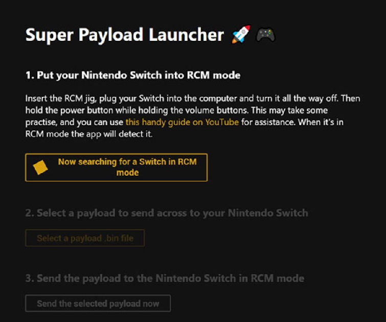

# Super Payload Launcher (for Nintendo Switch) 🚀🎮
A new, pretty, simple, and cross platform tool for injecting payloads onto your Nintendo Switch to boot into Atmosphere, Hekate, Android or other custom firmwares.

---

## Supported platforms 🖥️
Super Payload Launcher will happily launch your payloads from **Windows**, **Mac OS** and **Linux**.

*To use the application on Linux you currently have to build from source. A guide to this can be found below.*

## Download instructions 📥
Head to [the releases page](https://github.com/versionxcontrol/super-payload-launcher/releases) and grab the latest version for your operating system from there. The application does not require any install, just download and run the application from anywhere.

---



---

# How to build the application (for developers) 🏗️
This is an application built using [Electron](https://www.electronjs.org/). To get started make sure you've got NodeJS installed and up to date.

Check out the repo to your machine, and open the project's folder in your command line of choice.

### Install dependencies:
```
npm install
```
### Run the application:
```
node_modules/.bin/electron.cmd
```
Alternatively you can load the workspace in Visual Studio Code and use my premade launch configuration. Just open the workspace and hit play, on Windows, MacOS or Linux.

<br />

### To fix broken webusb bindings:
The current version of the webusb library has issues with it's binding file. If you're suffering from crashes or errors when building from source, run this command in the project folder.
#### Windows
```
node_modules/.bin/electron-rebuild.bat
```
#### MacOS/Linux
```
node_modules/.bin/electron-rebuild
```

---

# License 📄

This application is written and licensed under GPL-3.0. You are free to modify and distribute the code and application as you see fit. All that's required is a link back to the code here and give a credit to the application's author.

---

# Credits 👍

- Kate Temkin ([ktemkin](https://twitter.com/ktemkin)) for her amazing discovery of the initial Fusée Gelée exploit that all our Nintendo Switch homebrew is enabled by.
- Rajko Stojadinovic ([rajkosto](https://twitter.com/rajkosto)) for creating the TegraRcmSmash software that currently powers the Windows side of this application, until webusb sort their s**t out anyway 😛.
- Michael ([SciresM](https://twitter.com/SciresM)) who has been such a hero to the Switch homebrew/hacking community. We all use your software, bro.

---

# Contribute 🎁

Super Payload Launcher now supports translations for different locales! If you can speak a language other than English, please
consider translating **en.json** under the **src/locales** folder to your language of choice.

---

# Contact 📞

If you appreciate this software, or have some feedback to give, please email me at versionxcontrol@gmail.com, or follow/DM me [on Twitter @versionxcontrol](https://twitter.com/versionxcontrol).

If you REALLY like the software, you can also buy me a coffee 🙏 
</br></br><a href="https://www.buymeacoffee.com/versioncontrol" target="_blank"></a>
